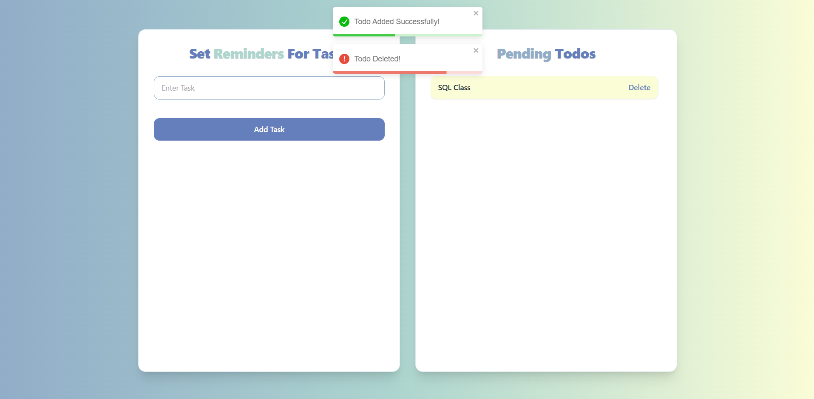

# Todo App

A modern and elegant Todo application built with **React**, **Tailwind CSS**, and **React Hook Form**.  
It also uses **React Toastify** for beautiful alerts.



---

## Features
- Add tasks with validation
- Delete tasks dynamically
- Real-time error handling using React Hook Form
- Toast notifications for user feedback
- Modern UI with Tailwind CSS and custom color palette
- Symmetric layout with scrollable task list

---

## Tech Stack
- **React** (Frontend framework)
- **Tailwind CSS** (Styling)
- **React Hook Form** (Form handling)
- **Nanoid** (Unique ID generation)
- **React Toastify** (Notifications)
- **Vite** (Build tool)

---

## Folder Structure
```
src/
 ├── components/
 │   ├── Create.jsx     # Component for adding todos
 │   ├── Read.jsx       # Component for displaying todos
 ├── App.jsx            # Main app entry
 ├── main.jsx           # React DOM rendering
 ├── index.css          # Global styles
public/                 # Static assets
```


## Installation & Setup

1. Clone this repository:
   ```bash
   git clone https://github.com/yourusername/todo-app.git
   cd todo-app
   ```

2. Install dependencies:
   ```bash
   npm install
   ```

3. Start the development server:
   ```bash
   npm run dev
   ```

4. Open [http://localhost:5173](http://localhost:5173) in your browser.

---

## Toast Notifications

- React-Toastify is used for alerts.
- You can trigger notifications like this:

   ```js
   import { toast } from "react-toastify";

   toast.success("Task added successfully!");

   ```

---

## Future Improvements

- Mark tasks as complete/incomplete

- Edit todos

- Save tasks in localStorage or a database

- Dark mode support

---

## License
This project is licensed under the **MIT License** — feel free to modify and use it.

---

## Author
**Arunavo Bhowal**  
💌 Reach me at [arunavobhowal.work@gmail.com](arunavobhowal.work@gmail.com)  
🔗 [Linkedin](https://www.linkedin.com/in/arunavo-bhowal/) | 🔗 [X](https://x.com/arunavo_bhowal) | 🔗 [GitHub](https://github.com/arunavo-bhowal)
